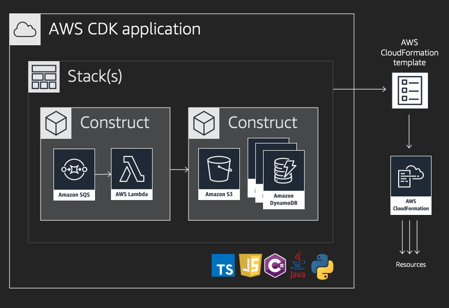
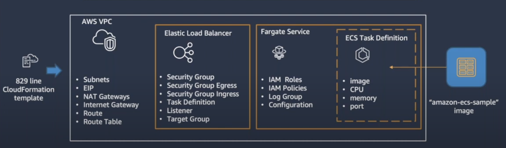

# AWS CDK: Infrastructure as Code Made Easy
발표자 : 김인철
소속 : TECH LAB

---
# IaC란
IaC(Infrastructure as Code)는 개별 리소스를 수동 으로 구성하는 대신 코드를 사용하여 IT 인프라를 정의하고 관리하는 방법입니다. 

즉, 서버, 네트워크 및 기타 리소스를 코드를 통해 인프라를 정의하고 관리할 수 있습니다. 
코드로 관리하므로서  더 나은 자동화, 반복성 및 일관성은 물론 더 쉬운 협업 및 버전 제어가 가능합니다. 
IaC는 최신 DevOps 중심으로 자리 잡고 있으며 AWS, Azure 및 Google Cloud Platform과 같은 클라우드 컴퓨팅 환경에서 광범위하게 사용 되어진다.

---

## Terraform
Terraform은 HCL(HashiCorp Configuration Language)를 통해 선언 기반 리소스 생성 관리
Cross Platform Tool

리소스의 생성 관리 변경의 상태관리 필요
롤백 관리
- Terraform은 수행하는 리소스 생성 수정 작업은 클라우드 공급자의 API에 대한 순차적 호출
실행 중간에 어떤 이유로 호출이 실패하면 Terraform이 중지되고 중간에 남아 있는 변경 사항을 다시 적용하도록 사용자에게 맡깁니다

---
## CDK
AWS 종속적이다

TypeScript, Python, Java 및 C#과 Go(Comming Soon) 같은 널리 사용되는 프로그래밍 언어를 사용
자동 롤백 및 Rollback 제어 가능
상태 관리는 Cloudformation 자체에 맡겨지며 관리할 상태 파일이 없습니다

---
# CDK 장점
프로그램 언어 친화적
재사용성 , OOP를 통한 확장 가능
git 등을 사용하며 인프라 버전관리, 코드리뷰, 문제 발생시 실수없는 빠른 롤백 등의 작업이 가능
상태관리 불필요
반드시 선언되어야하는 리소스, 반드시 설정 되어야하는 프로퍼티 등의 유닛 테스트를 통해 실수 할수 있는 가능성을 줄일수 있다.
많은 AWS 서비스 및 도구에 대한 높은 수준의 인터페이스를 제공하므로 다른 AWS 서비스와 쉽게 통합하고 전체 인프라 수명 주기를 관리할 수 있습니다

---

# 혹시 이런 경험 있으시나여?
* AWS Console로 구성 하고 관련 문서 메뉴얼 작성하여 공유 다 하였는데 해당 메뉴가 
안보여요
* 문서의 버튼이 없어요, 완전 다른 화면인데요
* 변겨된 화면의 설정이 이전 화면의 설정과 같은 기능인가? 운영 서비스 인데 적용 해도 되려나?
* 긴급 이슈가 발생시? 화면 메뉴 찾다 식은땀 ㅠㅠ
* 계속 반복되는 인프라 구성 작업
* 누군가 변경 했는데 왜 변경 한거지?

---

# CDK를 사용해야 하는 이유
AWS Console이 변경 되어도 CDK의 코드는 변경할 필요가 없다
간단한 코드 구성만으로 AWS의 Best Practice 적용 가능

---

# 구성 요소


---

# Constructs
- CDK App의 가장 기본 Building Blocks으로 cloud component라 표현한다.
- AWS 리소스를 템플릿으로 만들기 위한 AWS CloudFormation을 보다 추상화한 형태라고 볼수 있다
- single AWS resource
- 높은 level의 constructs는 multiple resource로 구성 (Pattern)

---

# Constructs Level(Layer)

Level 1
- Clouformation 리소스에 직접 대응 되는 저수준의 Construct Cfn 리소스라고도 한다.
ex) CfnBucket는 AWS::S3::BucketAWS CloudFormation 리소스

Level 2
- 적절한 기본값이 설정되어 있으므로 세부 정보에 대한 큰 고민 없이 손쉽게 AWS 리소스를 생성할 수 있다
- 편리한 다양한 API 제공(서비스 하나하나 추상화)
ex) S3.bucket : addLifeCycleRule() 추가메소드 제공

Level 3 : Pattern
- 레벨 3은 레벨2의 조합과 추가적인 옵션으로 이루어진다 
- aws 서비스로 구성된 패턴

---
# Level3 (pattern)

``` typescript
declare const cluster: ecs.Cluster;
const loadBalancedEcsService = new ecsPatterns.ApplicationLoadBalancedEc2Service(this, 'Service', {
  cluster,
  taskImageOptions: {
    image: ecs.ContainerImage.fromRegistry('test'),
  },
  desiredCount: 2,
});
```


---

# Stack(s)
- 배포 단위

``` typescript
public class MyCdkApp {
   public static void main(final String[] args) {
      App app = new App();

      new MyEcsStack(app, "myEcsStack");
      new MyMonitoringStack(app, "myMonitoring");

      app.synth();
   }
}
```

---

# App
- 스택의 모음
- CDK CLI를 통해 AWS CloudFormation 템플릿을 렌더링하고 배포할 수 있는 기능을 제공
- 리전 및 계정에 대한 정보가 포함된 하나 이상의 Stack으로 구성

---

# CDK VPC Sample
``` typescript
import * as ec2 from 'aws-cdk-lib/aws-ec2';
import * as cdk from 'aws-cdk-lib';

export class CdkStarterStack extends cdk.Stack {
  constructor(scope: cdk.App, id: string, props?: cdk.StackProps) {
    super(scope, id, props);

    const vpc = new ec2.Vpc(this, 'my-cdk-vpc', {
      cidr: '10.0.0.0/16',
      natGateways: 1,
      maxAzs: 2,
      subnetConfiguration: [
        {
          name: 'private-subnet-1',
          subnetType: ec2.SubnetType.PRIVATE_WITH_EGRESS,
          cidrMask: 24,
        },
        {
          name: 'public-subnet-1',
          subnetType: ec2.SubnetType.PUBLIC,
          cidrMask: 24,
        }
      ],
    });
  }
}
```

---

# 개발환경
- Node.js 설치
- AWS CLI 설치
- AWS configure 설정
- IDE 설치 (VS Code, InteliJ)
- AWS CDK 설치
``` node
npm install -g aws-cdk
```
- CDK Bootstrap

---

# CDK Bootstap
## CDK 애플리케이션을 사용하기 위한 필수적인 단계입니다.

```
cdk bootstrap aws://153278745791/ap-northeast-2
```
- AWS S3 버킷 생성: CDK 스택 배포에 필요한 패키지 및 템플릿 파일을 저장하기 위한 S3 버킷을 생성
- AWS CloudFormation 스택 생성: AWS CDK Toolkit CloudFormation 스택을 생성합니다. 이 스택은 CDK 애플리케이션에서 사용하는 AWS 리소스를 관리하고 배포하는 데 사용

---

# 개발 시작
``` node
cdk init app --language typescript
```
---

<style scoped>

table {
    height: 100%;
    width: 100%;
    font-size: 30px;
    text-align: left;
}
th {
    color: blue;
}
</style>
# CDK Command

|Command|Description|
|-----|-----------|
|**cdk bootstrap**|AWS 환경에 CDK Toolkit을 위한 스택을 배포|
|**cdk ls**|앱의 스택을 나열합니다.|
|**cdk diff**|이미 배포된 스택과 현재의 CDK 스택들을 비교하여 출력한다.|
|**cdk synth**|AWS CDK 애플리케이션을 AWS CloudFormation 템플릿으로 컴파일|
|**cdk deploy**|AWS CDK 애플리케이션을 설정된 AWS계정에 배포|
|**cdk destory**|배포된 CDK 애플리케이션을 삭제|

---

# 컨테이너 TF CDK 코드 리뷰

---

# CDK 개발 하면서 힘들었던 점

AWS CDK의 공식 문서는 아직 많이 부족한 상태
설명 부족
기본 설명 위주
필요로 하는 정보 찾기 어려움

--- 
- AWS 공식 Reference: [V2 Reference](https://docs.aws.amazon.com/cdk/api/v2/docs/aws-construct-library.html)

