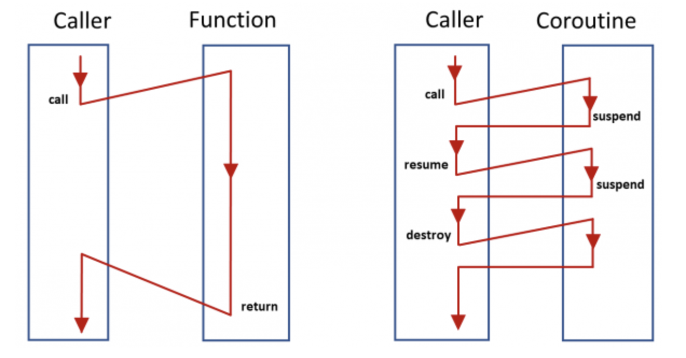

# Kotlin Coroutine로 Webflux의 날개를 달자
발표자 : 김인철
소속 : TECH LAB

---

# 도입 배경
저희 시스템은 사용자의 요청에 직접적으로 응답값을 만들고 처리할 수 있어야 합니다. 배민이기에 특정 시간에 쏟아져 들어오는 요청량에도 안정적이고 적은 비용으로 서비스가 가능하여야 하며, 이를 위해서 reactive stack인 webflux + Reactor를 활용하고 있습니다.

reactive stack을 이용하는 경우 대량의 트래픽들을 적은 스레드를 바탕으로 처리할 수 있으며, 높은 부하에서도 적은 하드웨어자원으로 안정적인 처리가 가능토록 만들어 줍니다. Reactor는 리모트콜을 병렬적으로 처리할 수 있는 일관적인 방법을 제공해주기 때문에 전체적인 API의 응답시간을 낮추기도 좋습니다

---

# Webflux 단점

Reactor에서 모든 함수의 결과는 Mono나 Flux 타입으로 반환하여야 합니다. 체이닝된 메서드가 이어지는 과정에서 비어있는 값을 하위에 잘못 전달되는 경우 결과가 나오지 않는 경우도 있으며, 언제 터질지 모르는 NPE에 언제나 대비하고 방어하여야 합니다. 마지막으로 비동기로 동작하기 때문에 에러가 발생하는 경우 스택트래이스는 실제 로직과 매끄럽게 매칭이 되지 않기도 합니다. 어디에서 에러가 발생했는지를 찾기가 쉽지 않았습니다.

Reactor를 처음 접했을 당시 이질적인 코드 스타일에 많이 당황했었습니다. 직관적으로 이해도 힘들었고 각 연산자들마다 어떠한 메커니즘으로 움직이는지 역시 쉽게 와닿지 않았었습니다. 지금도 Reactor 코드와는 많이 친해지지 못한 상태입니다.

---

# Coroutine

코드는 단순하여야 합니다. 특히나 요구사항이 다양하고 복잡해지는 사용자향 시스템이면 더욱 그렇게 되어야 한다고 생각합니다. 요청량이 많은 상황에서는 Reactor는 좋은 선택이었지만 그로 인해서 잃어버리는 단순함에 대한 비용은 높다고 많이 느끼게 되었습니다. 막말로 서버님이 좀 더 효율적으로 일하는 대신 개발자가 고생하게 된 상황인 거죠.

좀 더 나은 방법을 고민하던 중 코틀린에서 제공해주는 비동기 프레임워크인 Coroutine을 접하게 되었습니다. Coroutine은 무엇보다도 기존의 익숙한 코드스타일로 비동기를 처리할 수 있다는 큰 장점을 가지고 있습니다.

---

---