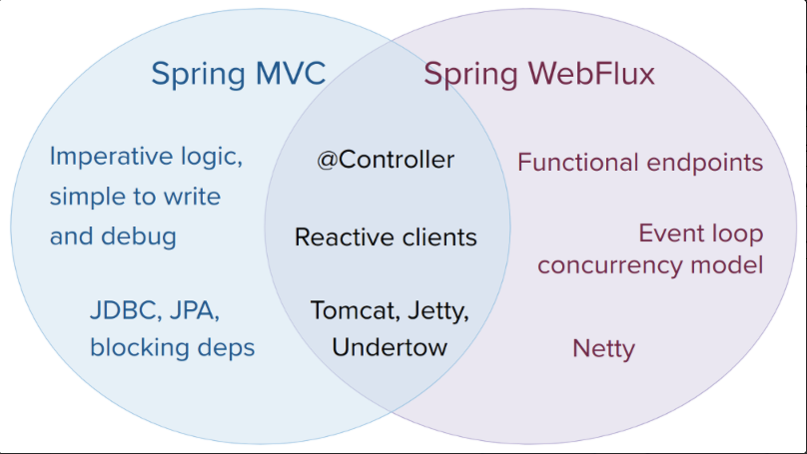
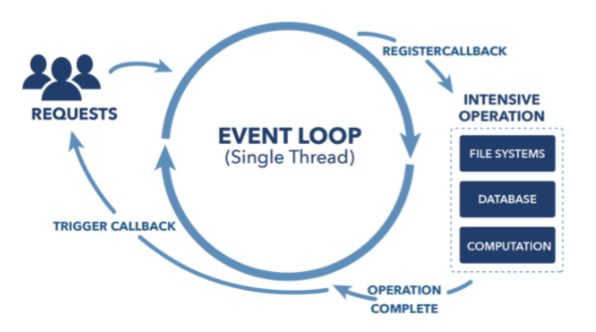
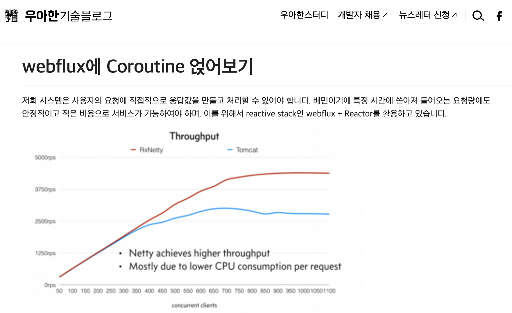

# Kotlin Coroutine로 Webflux의 날개를 달자
발표자 : 김인철
소속 : 테크랩

---

# WebFlux 란

Spring WebFlux는 리액티브 웹어플리케이션 구현을 위해 Spring5 부터 새롭게 추가된 리액티브 웹 프레임워크 입니다.

리액티브 스트림 처리를 기반으로 하는 비동기적이고 논블로킹(Non-blocking) 웹 애플리케이션을 구축하는데 사용됩니다. 

Reactor 프로젝트의 리액티브 스트림 구현체를 기반으로 동작하며, Java 8의 함수형 인터페이스와 스트림 API를 활용합니다. 이를 통해 개발자는 콜백 대신에 함수형 프로그래밍 스타일로 비동기 코드를 작성할 수 있습니다.

--- 



---



---

# Netty

네티는 서버엔진으로 네트워크 I/O 이벤트에 대한 콜백 함수를 등록하고 관리한다.
콜백 함수는 특정 이벤트가 발생할 때 자동으로 호출된다.
요청처리 방식을 이벤트 루프 방식으로 사용하였고, 이벤트 루프는 단일스레드를 사용한다.

스레드 갯수
- 내부 CPU 코어 수에 의해 결정된다.
- 이유 : 각 이벤트 루프는 독립적인 스레드에서 실행되는데 이때 너무 많은 스레드는 스레드스위칭 비용을 증가시키고 너무 적은 스레드는 CPU를 충분하게 활용할 수 없기 때문에
내부적인 CPU 코어의 수로 결정 하도록 설정되어있다.

---

# Webflux 도입 배경

웹플럭스를 사용하기 좋은 환경으로 무거운 연산이 적고 I/O 위주의 로직이 존재하는 환경을 입니다.
MATE 사장님앱 공통 백앤드 서비스는 MSA로 분리 되있는 API 호출을 통한 조합 및
DB 조회가 주 비지니스 로직 이다.
대량의 트래픽들을 적은 스레드를 바탕으로 처리할수 있어야 한다.

특정 시간에 쏟아져 들어오는 요청량에도 안정적이고 적은 비용으로 서비스가 가능하여야 하며, 이를 위해서 Spring 에서의 reactive stack인 webflux를 고민하게 되었습니다.

---

# Webflux 단점

Reactor에서 모든 함수의 결과는 Mono 나 Flux 타입으로 반환하여야 합니다. 체이닝된 메서드가 이어지는 과정에서 비어있는 값을 하위에 잘못 전달되는 경우 결과가 나오지 않는 경우도 있으며, 언제 터질지 모르는 NPE에 언제나 대비하고 방어하여야 합니다. 마지막으로 비동기로 동작하기 때문에 에러가 발생하는 경우 스택트래이스는 실제 로직과 매끄럽게 매칭이 되지 않기도 합니다. 어디에서 에러가 발생했는지를 찾기가 쉽지 않았습니다.

처음 접하는 Reactor의 이질적인 코드 스타일은 직관적으로 이해도 힘들었고 각 연산자들마다 어떠한 메커니즘으로 움직이는지 역시 쉽게 와닿지 않습니다.

서버 자원을 아끼기 위해 개발자가 고생하는 느낌

---

# Coroutine 도입 배경

코드는 단순 해야 합니다. 특히나 요구사항이 다양하고 복잡해지는 사용자 지향 시스템이면 더욱 그렇게 되어야 한다고 생각합니다. 
요청량이 많은 상황에서는 Reactor는 좋은 선택이었지만 그로 인해서 잃어버리는 단순함에 대한 비용은 높다고 많이 느끼게 됩니다. 

Coroutine 가장큰 장점은 익숙한 동기식 코드스타일로 비동기를 처리할 수 있다는 큰 장점을 가지고 있습니다. 
즉 Webflux의 Future/Promise 기반 구현을 개선 할수 있다.

---

# Coroutine

코틀린의 여러 장점들 중에 하나는 자바에는 없는 Coroutine(코루틴)이라는 개념을 제공한다는 것입니다.
코루틴은 코드를 'Non-Blocking'하게 동작시켜주는 기술이며 Reactive Streams와 비교되는 기술입니다.

코루틴은 Spring Framework 5.2, Spring Boot 2.2 버젼부터 사용이 가능
코루틴 지원을 통해서 Mono와 Flux가 아닌 코틀린의 문법인 suspend로 스프링 어플리케이션 작성이 가능

---



---

# subscribe Hell
``` kotlin
fun execute(inputValues: InputValues): Mono<Order> {
        val (userId, productIds) = inputValues

        return Mono.create { emitter ->
            userRepository.findUserByIdAsMaybe(userId)
                .subscribe { buyer ->
                    addressRepository.findAddressByUserAsPublisher(buyer)
                        .subscribe(LastItemSubscriber { address ->
                            checkValidRegion(address)
                            productRepository.findAllProductsByIdsAsFlux(productIds)
                                .collectList()
                                .subscribe { products ->
                                    check(products.isNotEmpty())
                                    storeRepository.findStoresByProductsAsMulti(products)
                                        .collect().asList()
                                        .subscribe().with { stores ->
                                            check(stores.isNotEmpty())
                                            orderRepository.createOrderAsFuture(
                                                buyer, products, stores, address
                                            ).whenComplete { order, _ ->
                                                emitter.success(order)
                                            }
                                        }
                                }
                        })
                }
        }
    }
```

---
# flatMap Hell
``` kotlin
fun execute(inputValues: InputValues): Mono<Order> {
        val (userId, productIds) = inputValues

        return RxJava3Adapter.maybeToMono(userRepository.findUserByIdAsMaybe(userId))
            .flatMap { buyer ->
                JdkFlowAdapter.flowPublisherToFlux(
                    addressRepository.findAddressByUserAsPublisher(buyer))
                    .last()
                    .flatMap { address ->
                        checkValidRegion(address)
                        productRepository.findAllProductsByIdsAsFlux(productIds)
                            .collectList()
                            .flatMap { products ->
                                check(products.isNotEmpty())
                                Flux.from(storeRepository.findStoresByProductsAsMulti(products))
                                    .collectList()
                                    .flatMap { stores ->
                                        check(stores.isNotEmpty())
                                        Mono.fromFuture(
                                            orderRepository.createOrderAsFuture(
                                                buyer, products, stores, address
                                            )
                                        )
                                    }
                            }
                    }
            }
    }
```
---

# Coroutine

``` kotlin
suspend fun execute(inputValues: InputValues): Order {
        val (userId, productIds) = inputValues

        // 1. 구매자 조회
        val buyer = userRepository.findUserByIdAsMaybe(userId).awaitSingle()

        // 2. 주소 조회 및 유효성 체크
        val address = addressRepository.findAddressByUserAsPublisher(buyer)
            .awaitLast()
        checkValidRegion(address)

        // 3. 상품들 조회
        val products = productRepository.findAllProductsByIdsAsFlux(productIds).asFlow().toList()
        check(products.isNotEmpty())

        // 4. 스토어 조회
        val stores = storeRepository.findStoresByProductsAsMulti(products).asFlow().toList()
        check(stores.isNotEmpty())

        // 5. 주문 생성
        val order = orderRepository.createOrderAsFuture(buyer, products, stores, address).await()

        return order
    }
```
---

## MATE 사장님앱 Kotlin Coroutine 적용 예
``` kotlin
    override suspend fun findUserByUserIdAndName(findDto: FindDto.PasswordRequest): Flow<FindUserVo>?  {
        validCertificationNumber(findDto.phoneNumber, findDto.certificationNumber)        
        val mateUsers = mateClient.getUserByUserInfo(MateFindUserRequest(userId = findDto.userId,userName = findDto.userName))
        if (findDto.findPosType == UserPosType.MATE) {
            return toFindUserVo(mateUsers)
        }

        return userFindMateAndSet(userQuery.findUserByUserInfo(findDto.userId, findDto.userName), mateUsers)
    }
```
``` kotlin
override suspend fun getUserByUserInfo(request: MateFindUserRequest): MateFindUserResponse {    
        var url = "/mpos/pos/master/v2/sys-users?userId=${request.userId}"
        request.userName?.let { url+= "&userNm=${request.userName}"}
        return try {
            webClient.mutate().baseUrl(baseUrl)
                .build()
                .get()
                .uri(url)
                .header(HttpHeaders.CONTENT_TYPE, MediaType.APPLICATION_JSON_VALUE)
                .retrieve()
                .awaitBody<MateFindUserResponse>()
        } catch (e: Exception) {
            e.printStackTrace()
            throw ApiException(ResponseCode.EXTERNAL_API_ERROR)
        }
    }
```    
---

# suspend
<style scoped>
section {
  font-size: 25px;
}
</style>

이 함수는 특정 시점에서 멈추고 재실행이 가능한 함수를 나타낸다.


---

# Flux Mono 간단한 개념
- Reactor 프로젝트의 리액티브 스트림 타입 이며 비동기 방식을 구현해주는 주요 객체 입니다.
## Mono
- 0개 또는 1개의 요소를 발행할 수 있는 리액티브 스트림 입니다. 
즉, Mono는 단일 값을 발행하거나 아무 값도 발행하지 않을 수 있습니다.
## Flux
- 0개 ~ N개의 요소를 발행할 수 있는 리액티브 스트림입니다
즉 여러 값을 연속적으로 발행하고, 이를 구독자(Subscriber)가 비동기적으로 처리할 수 있도록 합니다

---
# Mono


---
# Flux


---

# 예제
<style scoped>
section {
  font-size: 25px;
}
</style>


``` kotlin
suspend fun doSomethingGetDatabase(): Int {
    delay(1000L) // DB 조회하여 대기중
    return 13
}
suspend fun doSomethingGetApiCall(): Int {
    delay(1000L) // API 호출하여 대기중
    return 29
}

fun main() = runBlocking {
    val time = measureTimeMillis {
        val one = async { doSomethingUsefulOne() }
        val two = async { doSomethingUsefulTwo() }
        println("13 + 29 는 ${one.await() + two.await()} 입니다")
    }
    println("Completed in $time ms")
}
```
---
# R2DBC 설명

R2DBC는 Reactive Relational Database Connectivity의 약자입니다. R2DBC는 리액티브 프로그래밍 모델을 사용하여 관계형 데이터베이스와의 상호작용을 지원하는 자바 기반의 라이브러리입니다.

R2DBC는 기존의 JDBC(Java Database Connectivity)와 비교할 때 리액티브 프로그래밍의 개념을 적용하고 있습니다. 리액티브 프로그래밍은 비동기적이고 논블로킹(Non-blocking)인 코드 작성을 지향하며, 데이터 스트림을 통해 이벤트 기반의 프로그래밍을 가능하게 합니다. R2DBC는 이러한 리액티브 프로그래밍 모델을 적용하여 데이터베이스와의 상호작용을 처리할 수 있도록 설계되었습니다.

R2DBC는 여러 가지 관계형 데이터베이스 시스템과 통합되는 드라이버를 제공하며, 개발자가 비동기 및 리액티브 코드를 사용하여 데이터베이스와 상호작용할 수 있도록 합니다. 이를 통해 데이터베이스 작업이 블로킹되지 않고, 효율적인 리소스 사용과 더 높은 확장성을 실현할 수 있습니다.

---
# Spring Data R2DBC
리액티브 프로그래밍 모델을 사용하여 R2DBC를 활용하여 데이터베이스와 상호작용하는 기능을 제공합니다.
Spring Data JPA 와 같이 메소드 기반 쿼리 제공
- Java 기반 : ReactiveCrudRepository
- kotlin 기반 : CoroutineCrudRepository
아래 코드는 Mate 사장님앱 백앤드 소스
``` kotlin
suspend fun AppUserRepository.findLoginUserByStaffId(staffId: String): AppUser? = findByStaffIdAndIsUsedAndIsLogin(staffId, YesOrNo.Y, YesOrNo.Y)
interface AppUserRepository : CoroutineCrudRepository<AppUser, String> {

    @Query("SELECT * FROM ${AppUser.TABLE_NAME} where 아이디 = :staffId and 사용여부 = :#{#isUsed.insideCode} ")
    suspend fun findByStaffIdAndIsUsed(staffId: String, isUsed: YesOrNo): AppUser?
    suspend fun findByRepresentativeIdAndIsAdmin(representativeId: String, isAdmin: YesOrNo): Flow<AppUser>
    @Query("SELECT * FROM ${AppUser.TABLE_NAME} where 아이디 = :staffId and 사용여부 = :#{#isUsed.insideCode} and 로그인여부 = :#{#isLogin.insideCode} ")
    suspend fun findByStaffIdAndIsUsedAndIsLogin(staffId: String, isUsed: YesOrNo, isLogin: YesOrNo): AppUser?
    suspend fun findByStaffIdAndPushToken(staffId: String, pushToken: String ): AppUser?
    suspend fun findByStaffId(staffId: String): AppUser?
}
```
---
# QueryDsl 대체?
DataClient를 이용한 쿼리 작성 (val client: DatabaseClient)
``` kotlin
suspend fun findPosUserStaff(userId: String, password: String): PosLoginVo? {
        suspend fun countByUserId(userId: String): Int {
        val sql = "SELECT SUM(cnt) as CNT \n" +
                "        FROM (\n" +
                "          SELECT COUNT(*) AS cnt\n" +
                "          FROM UNIDOM_USR.${AppUser.TABLE_NAME} \n" +
                "          WHERE 아이디 = :userId \n" +
                "          UNION ALL\n" +
                "          SELECT COUNT(*) AS cnt\n" +
                "          FROM ${User.TABLE_NAME} \n" +
                "          WHERE  사용자ID = :userId \n" +
                "          UNION ALL\n" +
                "          SELECT COUNT(*) AS cnt\n" +
                "          FROM POSBOSS_USR.매장\n" +
                "          WHERE 대표사용자ID = :userId \n" +
                "        )"
        return client.sql(sql)
            .bind("userId", userId)
            .map { row, _ -> row.get("CNT", Int::class.javaObjectType)!! }
            .awaitOne()
    }
```
---
# Webclient 
스프링 웹플럭스는 리액티브, 넌블로킹 HTTP 요청을 위한 WebClient를 제공합니다.
WebClient는 리액티브 타입을 사용하는 함수형 API기 떄문에 선언적인 프로그래밍이 가능합니다.
기존의 동기 API를 제공할 뿐만 아니라, 논블로킹 및 비동기 접근 방식을 지원해서 효율적인 통신이 가능 합니다.
https://godekdls.github.io/Reactive%20Spring/webclient/

---


참고 자료

[Mono](https://projectreactor.io/docs/core/release/api/reactor/core/publisher/Mono.html)
[Flux](https://projectreactor.io/docs/core/release/api/reactor/core/publisher/Flux.html)
[WebClient](https://docs.spring.io/spring-framework/reference/web/webflux-webclient.html)

[Coroutines are light-weight](https://kotlinlang.org/docs/coroutines-basics.html#coroutines-are-light-weight)

[Spring data R2DBC](https://spring.io/projects/spring-data-r2dbc)

[배민광고리스트 개발기](https://techblog.woowahan.com/7349/)


---